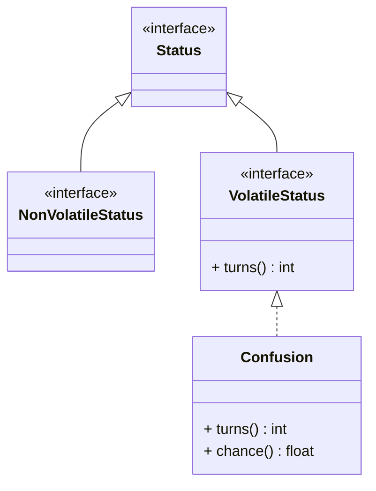

# Bored of OOP? Have you tried DOP yet?


<div class="abs-br m-6 flex gap-2">
  <a href="https://github.com/mechtee/dop-java" target="_blank" alt="GitHub" title="Open in GitHub"
    class="text-xl slidev-icon-btn opacity-50 !border-none !hover:text-white">
    <carbon-logo-github />
  </a>
</div>

<!--
Willkommen zu meinem Talk.
-->

---
layout: image
image: /images/jfs_itsme.jpg
title: Inspiration
---

<!--

* Weiterbildung und Horizonterweiterung durch Konferenzen & Talks
* Nicht nur JAVA (auch bspw. RUST)
* JFS 2023
* Ron Veen's Modern Java - This is not your father's Java anymore

-->

---
layout: image
image: /images/inspiration-1920-1080.png
hideInToc: true
---

<!--
* Slide die mich abgeholt hat
* erinnert stark an eine spätere folie
-->

---
transition: slide-up
layout: image
image: /images/that_damned_slide-1920-1080.png
---


---
transition: slide-up
layout: default
hideInToc: true
---

# Table of contents

<Toc maxDepth="1"></Toc>

---
transition: slide-up
level: 1
layout: image-right
image: /images/oop_dall-e.png
title: OOP v DOP
---

# OOP

* complex entities and systems

<br>

* modelling business entities and processes

<br>

* great at defending boundaries

<br>

* leads to modular reasoning

<!--
- Programmierparadigma mit Fokus auf Modellierung von Objekten und deren Interaktionen.
- Ein Objekt ist eine Instanz einer Klasse und enthält Daten (Attribute) und Methoden (Funktionen), die auf diese Daten zugreifen.
OOP ermöglicht die Abstraktion von komplexen Systemen, indem es diese in kleinere, modulare Einheiten (Objekte) aufteilt.
- Vererbung ermöglicht es, Eigenschaften und Methoden von einer Klasse auf eine andere zu übertragen, was die Wiederverwendbarkeit von Code erhöht.
- Polymorphie ermöglicht es, dass Objekte unterschiedliche Formen annehmen und auf unterschiedliche Weise verwendet werden können, was die Flexibilität erhöht.
-->

---
transition: slide-up
level: 1
layout: image-left
image: https://blog.klipse.tech/uml/chapter00/do-principles-mind-map.png
hideInToc: true
---

# DOP

* model data instead

<br>

* consume data from outside world

<br>

* validate data at service boundary

<br>

* less/no internal boundaries

<!--
- Anstatt Objekten modellieren wir Daten
- Wir konsumieren meist von außen
- Validierung nehmen wir an den Servicegrenzen vor
- Wir haben meist keine oder wenige interne Grenzen

- möglich in allen OOP und FP Sprachen
- Daten sind first class citizen
-->

---
title: Principles of DOP
layout: two-cols
transition: slide-up
clicks: 4
---

# Sharvit Principles
|   |
| ------ |
| <div v-mark.underline.orange="[1,2]"> 1. Seperate data from logic </div> |
| |
| <div v-mark.underline.orange="[2,3]"> 2. Data is stored in generic data structures </div> |
| |
| <div v-mark.underline.orange="[3,4]"> 3. Data is immutable </div> |
| |
| <div v-mark.underline.orange="[4,5]"> 4. Seperate Schema from Data </div> |

::right::

# Goetz/Java Principles

|    |
| ------ |
| <div v-mark.underline.orange="[1,2]"> 1. Model the data, the whole data, and nothing but the data </div>|
| |
| <div v-mark.underline.orange="[2,3]"> 2. Make illegal states unrepresentable </div> |
| |
| <div v-mark.underline.orange="[3,4]"> 3. Data is immutable </div> |
| |
| <div v-mark.underline.orange="[4,5]"> 4. Validate at the boundary </div> |

<div class="mt-16 ml-16">
<a href="https://www.infoq.com/articles/data-oriented-programming-java/" target="_blank">
  INFOQ - Data-oriented Programming in Java</a>
</div>

<style>
table, td, th, tr {
  border: none;
}
tbody tr:first-of-type td{
  height: 5rem;
}
</style>

<!--
Principle 1:
+ code reusability, tested in isolation,  reduces complexity
- more entities in system, what code can access what data?

Principle 2:
+ generic functions and flexibility
- no compile time check or schema, explicit type casting

Principle 3:
+ concurrency and data access with confidence, predictable behaviour, fast equality
- performance, verbose change of data

Principle 4:
+ what do we validate, what do we even need?
- performance hit?
-->


---
layout: default
---

# Project AMBER and JEPs
Incubator Project like Loom, Valhalla

* Switch Expressions
* Records
* Sealed Classes
* Pattern Matching


<!--
Features in PROJECT AMBER 
- for developer expierence
- used singularly or combined


YOU ARE HERE!

Wer arbeitet mit was?

Java 8 und älter?
Java 11 und älter?
Java 17 und älter?
Java 21?
Java 22?
-->

---
level: 2
---

<Titles>
  <div class="flex w-full flex-row justify-between items-center">
    <div class="bg-orange-500 shadow h-10 w-10 text-center justify-center items-center flex mb-4"><h4 class="text-white">12</h4></div>
    <h1 class="flex align-center justify-center items-center">Switch expressions JEP 361</h1>
    <div class="bg-green-500 shadow h-10 w-10 text-center justify-center items-center flex mb-4"><h4 class="text-white">14</h4></div>
  </div>
</Titles>


````md magic-move

```java
var memeOfTheDay = "";
switch (day) {
  case WEDNESDAY:
    memeOfTheDay = "ITS WEDNESDAY MY DUDES";
    break;
  case FRIDAY:
    memeOfTheDay = "IT'S FRIDAY, FRIDAY!";
    break;
  default:
    memeOfTheDay = "None found."
}
```

```java
var memeOfTheDay = switch (day) {
  case WEDNESDAY  -> "ITS WEDNESDAY MY DUDES";
  case FRIDAY     -> "IT'S FRIDAY, FRIDAY!";
  default         -> "None found."
}
```
````

<!--
- can now be used as expression
- right of arrow can be:
  - expression
  - block (here you can yield)
  - throw (for convenience)

- exhaustiveness as always
- fall-through
- better scoping
-->

---
layout: default
level: 2
---

<Titles>
  <div class="flex w-full flex-row justify-between items-center">
    <div class="bg-orange-500 shadow h-10 w-10 text-center justify-center items-center flex mb-4"><h4 class="text-white">14</h4></div>
    <h1 class="flex align-center justify-center items-center">Records JEP 395</h1>
    <div class="bg-green-500 shadow h-10 w-10 text-center justify-center items-center flex mb-4"><h4 class="text-white">16</h4></div>
  </div>
</Titles>

* classes that act as transparent carriers of immutable data
* nominal tuples

<div class="mt-10 flex justify-center align-items-center">
  
</div>

<!--
Goals: 
- simple aggregation of values
- focus on modeling immutable data rather than extensible behavior.
- automatically implement data-driven methods
- Preserve nominal typing and migration compatibility.

Rules:
- cannot extend explicitly (implicitly extends java.lang.Record)
- implicitly final and cannot be abstract
- no real instance fields (header only)
- no native keyword
- record components and annotations on them
-->

---
layout: full
level: 2
---

````md magic-move

```java
record PokeDexEntry(int dexNo, String name) {}
```

```java
final class PokeDexEntry {
  private final int dexNo;
  private final String name;

  PokeDexEntry(int dexNo, String name) {
    this.dexNo = dexNo;
    this.name = name;
  }

  int dexNo() {return dexNo;}
  String name() {return name;}

  public boolean equals(Object o) {
    if (!(o instanceof PokeDexEntry)) return false;
    PokeDexEntry other = (PokeDexEntry) o;
    return other.dexNo == dexNo && other.name == name;
  }

  public int hashCode() {
    return Objects.hash(dexNo, name);
  }

  public String toString() {
    return String.format("DexEntry[dexNo=%d, name=%s]", dexNo, name);
  }
}
```
````

<style>
.slidev-layout {
  padding-top: 1rem
}
</style>

---
layout: default
level: 2
---

<Titles>
  <div class="flex w-full flex-row justify-between items-center">
    <div class="bg-orange-500 shadow h-10 w-10 text-center justify-center items-center flex mb-4"><h4 class="text-white">14</h4></div>
    <h1 class="flex align-center justify-center items-center">Sealed Classes JEP 409</h1>
    <div class="bg-green-500 shadow h-10 w-10 text-center justify-center items-center flex mb-4"><h4 class="text-white">16</h4></div>
  </div>
</Titles>


<div class="flex flex-row w-full">

<div class="flex w-2/3" id="magic-move-container">

````md magic-move

```java
interface Status {}


// non-volatile statuses need to be healed
interface NonVolatileStatus 
    extends Status {}

// volatile statuses subside after X turns
interface VolatileStatus extends Status {

  int turns();
}

interface PreventionStatus 
    extends VolatileStatus {}

record Confusion(float chance, int turns) 
    implements PreventionStatus {}
...
```

```java
sealed interface Status 
    permits NonVolatileStatus, VolatileStatus {}

// non-volatile statuses need to be healed
sealed interface NonVolatileStatus 
    extends Status {}

// volatile statuses subside after X turns
sealed interface VolatileStatus extends Status 
    permits PreventionStatus {
  int turns();
}

sealed interface PreventionStatus 
    extends VolatileStatus permits Confusion {}

record Confusion(float chance, int turns) 
    implements PreventionStatus {}
...
```

```java
sealed interface Status 
    permits NonVolatileStatus, VolatileStatus {}

// non-volatile statuses need to be healed
sealed interface NonVolatileStatus 
    extends Status {}

// volatile statuses subside after X turns
sealed interface VolatileStatus extends Status 
    permits PreventionStatus {
  int turns();
}

sealed interface PreventionStatus 
    extends VolatileStatus {

  record Confusion(float chance, int turns) 
      implements PreventionStatus {}
}


```


```java
sealed interface Status 
    permits NonVolatileStatus, VolatileStatus {}

// non-volatile statuses need to be healed
sealed interface NonVolatileStatus 
    extends Status {}

// volatile statuses subside after X turns
sealed interface VolatileStatus extends Status
    permits PreventionStatus {
  int turns();
}

non-sealed interface PreventionStatus 
    extends VolatileStatus {}

record Confusion(float chance, int turns) 
    implements PreventionStatus {}
...
```

````

</div>

<div class="flex w-1/3">




</div>
</div>

<!--
main motivation: widely accessible but not widely extensible.

Constraints:
All permitted subclasses must belong to the same module as the sealed class.
Every permitted subclass must explicitly extend the sealed class.
Every permitted subclass must define a modifier: final, sealed, or non-sealed.

* with (final) records we have **algebraic data types!**

* records being the product type and sealed interfaces being the sum types

* Status = SumType /Choice Type
* Status Types = Unit Types
* Confusion = Product Type
-->

<style>
#magic-move-container div {
  width: 100%;
  margin-right: 1rem !important;
}
</style>

---
layout: default
---

<Titles>
  <div class="flex w-full flex-row justify-between items-center">
    <div class="bg-orange-500 shadow h-10 w-10 text-center justify-center items-center flex mb-4"><h4 class="text-white">14</h4></div>
    <h1 class="flex align-center justify-center items-center">Pattern matching for instanceof JEP394</h1>
    <div class="bg-green-500 shadow h-10 w-10 text-center justify-center items-center flex mb-4"><h4 class="text-white">16</h4></div>
  </div>
</Titles>

<div class="-mt-8">

````md magic-move

```java
if (obj instanceof Status) {
  // grr...
  Status s = (Status) obj;
  ...
}
```

```java
if (obj instanceof Status s) {
  // Let pattern matching do the work
  ...
}
```

````

</div>

<div class="w-full flex gap-8 mt-8">
  <div v-click class="w-1/2">

  ```java
  if (a instanceof Status s) {
    ...// s is in scope
  }


  // s not in scope here
  if (b instanceof Status s) {
    ...
  }
  ```

  </div>
  <div v-click class="w-1/2">

  ```java
  if (obj instanceof Confusion c 
        && c.turns() > 1) {
    // works
  }

  if (obj instanceof Confusion c
        || c.turns() > 1) {
    // doesn't work :(
  }
  ```

  </div>
</div>

<style>
div.slidev-code-wrapper.slidev-code-magic-move.relative {
  margin-top: 2rem !important;
}
</style>

<!--
A pattern is a combination of (1) a predicate, or test, that can be applied to a target, and (2) a set of local variables, known as pattern variables, that are extracted from the target only if the predicate successfully applies to it.
-->

---
layout: default
level: 2
---

<Titles>
  <div class="flex w-full flex-row justify-between items-center">
    <div class="bg-orange-500 shadow h-10 w-10 text-center justify-center items-center flex mb-4"><h4 class="text-white">19</h4></div>
    <h1 class="flex align-center justify-center items-center">Record Pattern Matching JEP 440</h1>
    <div class="bg-green-500 shadow h-10 w-10 text-center justify-center items-center flex mb-4"><h4 class="text-white">21</h4></div>
  </div>
</Titles>

````md magic-move

```java
if (obj instanceof Confusion c) {
  int turns = c.turns();
  if (turns > 0) {
    float chance = c.chance();
    boolean isConfused = calcConfusionCheck(c.chance());
    if (isConfused) {
      // grr...
      println("It hurt itself in it's confusion.");
    }
  }
  ...
}
```

```java
if (obj instanceof Confusion(int turns, float chance)) {
  if (turns > 0) {
    boolean isConfused = calcConfusionCheck(chance);
    if (isConfused) {
      // grr...
      println("It hurt itself in it's confusion.");
    }
  }
  ...
}
```

````

<!--
- Extend pattern matching to destructure instances of record classes, enabling more sophisticated data queries.

- Add nested patterns, enabling more composable data queries.
-->

---
layout: default
level: 2
clicks: 5
---

<Titles>
  <div class="flex w-full flex-row justify-between items-center">
    <div class="bg-orange-500 shadow h-10 w-10 text-center justify-center items-center flex mb-4"><h4 class="text-white">17</h4></div>
    <h1 class="flex align-center justify-center items-center">Pattern Matching for switch JEP 441</h1>
    <div class="bg-green-500 shadow h-10 w-10 text-center justify-center items-center flex mb-4"><h4 class="text-white">21</h4></div>
  </div>
</Titles>

````md magic-move

```java
if (status instanceof MajorStatus mStatus) {
  applyMajorStatus(mStatus);
} else if (status instanceof DamagingStatus dStatus) {
  applyDamagingStatus(dStatus)
} else if (status instanceof PreventionStatus pStatus) {
  applyPreventionStatus(pStatus)
} ...
// there are 12 volatile statuses
```

```java
switch (status) {
  case MajorStatus mStatus      -> applyMajorStatus(mStatus);
  case DamagingStatus dStatus   -> applyDamagingStatus(dStatus);
  case PreventionStatus pStatus -> applyPreventionStatus(pStatus);
  ...
}
```

````
<div v-click></div>
<div class="flex w-full gap-4 mt-8">
<div v-click="[2,6]" class="w-1/2">

````md magic-move

```java
switch (status) {
// Case refinement no guards:
  case VolatileStatus vStatus -> {
    if (vStatus.turns() > 0) {
      applyVolatileStatus(vStatus);
    } else {
      removeStatus(vStatus);
    }
  }
}
```

```java
switch (status) {
// Case refinement with guards:
  case VolatileStatus vStatus
      when vStatus.turns() == 0 ->
    removeStatus(vStatus);
  case VolatileStatus vStatus ->
    applyVolatileStatus(vStatus);
}
```

````
</div>
<div v-click></div>
<div v-click="[4,6]" class="w-1/2">

````md magic-move

```java
if (s == null) { // extra null handling
  println("😭")
}
switch (s) {
  case "FOO", "BAR" -> println("😂");
  default -> println("😐");
}
```

```java
// switch handles null
switch (s) {
  case null -> println("😭");
  case "FOO", "BAR" -> println("😂");
  default -> println("😐");
}
```

````

</div>

</div>

<style>
div.w-1\/2.flex.flex-auto div {
  width: 100%
}
</style>

<!--
- Expand the expressiveness and applicability of switch expressions and statements by allowing patterns to appear in case labels.
- Increase the safety of switch statements by requiring that pattern switch statements cover all possible input values.

- Allow the historical null-hostility of switch to be relaxed when desired.
-->

---
layout: default
level: 2
clicks: 4
transition: slide-up
---

<Titles>
  <div class="flex w-full flex-row justify-between items-center">
    <div class="bg-orange-500 shadow h-10 w-10 text-center justify-center items-center flex mb-4"><h4 class="text-white">21</h4></div>
    <h1 class="flex align-center justify-center items-center">Unnamed Variables & Patterns JEP456</h1>
    <div class="bg-green-500 shadow h-10 w-10 text-center justify-center items-center flex mb-4"><h4 class="text-white">22</h4></div>
  </div>
</Titles>

````md magic-move

```java
static int countStatuses(Iterable<Status> statuses) {
  int total = 0;
  for (Status status: statuses)
    total++;
  return total;
}
```

```java
static int countStatuses(Iterable<Status> statuses) {
  int total = 0;
  for (Status _ : statuses)
    total++;
  return total;
}
```

````
<div v-click></div>
<div v-click="[2,6]" class="mt-8">

````md magic-move

```java
switch (box) {
  case Box(RedBall red)     -> processBox(box);
  case Box(BlueBall blue)   -> processBox(box);
  case Box(GreenBall green) -> stopProcessing();
  case Box(var nullBall)    -> pickAnotherBox();
}
```

```java
// refinement with unnamed variables
switch (box) {
  case Box(RedBall _), Box(BlueBall _) -> processBox(box);
  case Box(GreenBall _)                -> stopProcessing();
  case Box(var _)                      -> pickAnotherBox();
}
```

```java
// further refinement with unnamed pattern:
switch (box) {
  case Box(RedBall _), Box(BlueBall _) -> processBox(box);
  case Box(GreenBall _)                -> stopProcessing();
  case Box(_)                          -> pickAnotherBox();
}
```

````

</div>

<!--
- clarify programs and reduce opportunities for error.
- Improve the maintainability of all code by identifying variables that must be declared (e.g., in catch clauses) but are not used.
- Allow multiple patterns to appear in a single case label, provided that none of them declare any pattern variables.
- Improve the readability of record patterns by eliding unnecessary nested type patterns.
-->

---
level: 2
clicks: 5
---

<Titles>
  <div class="flex w-full flex-row justify-between items-center">
    <div class="bg-orange-500 shadow h-10 w-10 text-center justify-center items-center flex mb-4 -mt-10"><h4 class="text-white">23</h4></div>
    <h1 class="flex align-center grow-0	 justify-center items-center text-center">Primitive Types in Patterns, instanceof, <br/> and switch JEP507, JEP488, JEP455</h1>
    <div class="bg-green-500 shadow h-10 w-10 text-center justify-center items-center flex mb-4 -mt-10"><h4 class="text-white">??</h4></div>
  </div>
</Titles>

````md magic-move

```java
switch (x.getStatus()) {
    case 0 -> "okay";
    case 1 -> "warning";
    case 2 -> "error";
    default -> "unknown status: " + x.getStatus();
}

```


```java
switch (x.getStatus()) {
    case 0 -> "okay";
    case 1 -> "warning";
    case 2 -> "error";
    case int i -> "unknown status: " + i;
}

```

```java
switch (x.getYearlyFlights()) {
    case 0 -> ...;
    case 1 -> ...;
    case 2 -> issueDiscount();
    case int i when i >= 100 -> issueGoldCard();
    case i -> ...;
}

```

````

<div v-click></div>

<div v-click="[3,6]" class="w-full flex gap-8 mt-8">
<div class="w-1/2">

````md magic-move

```java
int getPopulation() {...}
// silent potential loss of information
float pop = getPopulation();
...

if (i >= -128 && i <= 127) {
  byte b = (byte) i;
  ...
}

```

```java
if (getPopulation() instanceof float pop) {
  ...
}

if (i instanceof byte b) {
  ...
}

```

````

</div>

<div v-click class="w-1/2">

```java
Byte b = ...
switch (b) { 
  // exhaustive switch
  case int p -> 0;
}

```

</div>

</div>

<!--
- Pattern matching for switch does not support primitive type patterns
- Record patterns have limited support for primitive types
- Pattern matching for instanceof does not support primitive types
- Primitive types in instanceof and switch
-->

---
layout: image-right
image: /images/nurse_joy.png
level: 1
transition: slide-up
---
# DEMO: 
* Pokemon need healing after fights
* New Pokemon Generations introduced new Regions and PokeDex
* Different regional Pokemons require different Healing (assumption)


---
layout: default
title: How do others do it?
---

# How do others do it? - Kotlin

<div class="flex flex-row w-full">
<div class="flex w-2/3 pr-10">

* record-"like" data classes
* sealed classes and interfaces (Kotlin 1.5)
* `when` pattern matching is limited ([KT-4608](https://youtrack.jetbrains.com/issue/KT-4608/Support-recursive-nested-destructuring), [KT-13626](https://youtrack.jetbrains.com/issue/KT-13626))

</div>

<div class="flex w-1/3">


</div>
</div>
<div class="mt-8" v-click>

```kotlin
sealed interface Pokemon {
  data class KantoPokemon(val nickName: String) : Pokemon
  data class JohtoPokemon(val nickName: String) : Pokemon
}

// healingService
fun healPokemon(pokemon: Pokemon) = when (pokemon) {
  is KantoPokemon -> healKantoPokemon(pokemon)
  is JohtoPokemon -> healJohtoPokemon(pokemon)
}

```

</div>


---
layout: default
transition: slide-up
hideInToc: true
---

# How do others do it? - Rust

<div class="flex flex-row gap-2">
<div class="flex w-2/3">

* data oriented sees shared mutable data as a very bad thing
* rust: manage access to that shared data and who can mutate

</div>

<div class="flex w-1/3">


</div>
</div>

<div class="flex flex-1 flex-row w-full gap-2 mt-4">
<div v-click class="w-1/2">

```rust
pub enum Option<T> {
  None, /// No value.
  Some(T),// Some value of type `T`.
}
```

</div>

<div v-click class="w-1/2">

```rust
pub enum Result<T, E> {
  Ok(T), // success value
  Err(E),// error value
}
```

</div>

</div>

<div class="flex flex-row flex-1 w-full gap-2 mt-4">

<div class="w-1/2" v-click>

```rust
let option = Some("Value");
match option { //extensive pattern matching
  Some(val) => println!("Found {}", val),
  None => println!("We have no value")
};
```

</div>

<div class="w-1/2" v-click>

```rust
let result = Err("OW it did not worky")
if let Err(error_msg) = result {
  println!("Error occured: {}", error_msg);
}
// else or continue flow
```

</div>
</div>


---
layout: default
---

<!-- todo: add some image! -->

# Conclusion
* useful especially for small units like microservices
* mainly handling outside data
* DOP can be a nice addition to OOP
* Try it some time :)

---
layout: quote
transition: slide-up
---

<div class="flex justify-center">
Don't be a Functional programmer, don't be an Object Oriented programmer, be a better programmer.
</div>
<!--TODO: maybe this could be better-->
<div class="flex justify-end mt-8">
Brian Goetz
</div>

---
transition: slide-up
hideInToc: true
layout: image
image: /images/questions.jpg
title: Q & A
---

---
hideInToc: true
---

# THANK YOU & contact me here:

<div class="text-3xl mb-8" >

- E-Mail: mechti.oezdogan@exxeta.com
- Github: https://github.com/MechTee/
- LinkedIn: https://www.linkedin.com/in/mechtee/

</div>


## Slides here:
<!-- TODO: update this!-->
<div class="flex justify-center">
  
</div>

---
layout: default
hideInToc: true
---

<Titles>
  <div class="flex w-full flex-row justify-between items-center">
    <div class="bg-orange-500 shadow h-10 w-10 text-center justify-center items-center flex mb-4"><h4 class="text-white">23</h4></div>
    <h1 class="flex align-center justify-center items-center">Derived Record Creation JEP 468
</h1>
    <div class="bg-green-500 shadow h-10 w-10 text-center justify-center items-center flex mb-4"><h4 class="text-white">??</h4></div>
  </div>
</Titles>


````md magic-move

```java
Point newLoc = new Point(oldLoc.x() * 2, oldLoc.y(), oldLoc.z());

or

record Point(int x, int y, int z) {
    Point withX(int newX) { return new Point(newX, y, z); }
    Point withY(int newY) { return new Point(x, newY, z); }
    Point withZ(int newZ) { return new Point(x, y, newZ); }
}

```

```java
Point nextLoc = oldLoc with {
    x *= 2;
    y *= 2;
    z *= 2;
};
```
````